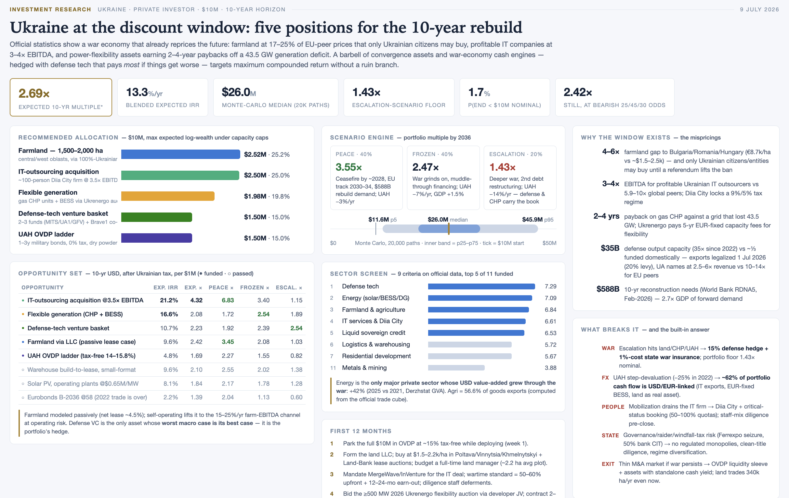

# Sol vs Fable — Ukraine investment-research comparison

This repository holds the outputs of two AI coding agents — **OpenAI Codex** and **Claude Code** — each given the same task: build a 10-year, $10M Ukraine investment plan from official Ukrainian government statistics, delivered as one slide plus a folder of calculations and sources. Each agent's output is published exactly as produced (only the top-level folder name was standardized), together with a side-by-side comparison of the two runs.

## Prompt

Both agents received the identical task prompt:

```
Act as an investment research analyst. Using official statistics and data from Ukrainian government: https://stat.gov.ua/en
Identify the most promising sectors and specific investment opportunities in Ukraine for a private investor with $10M in capital, optimizing for maximum return over a 10-year horizon.
Return your result in one big slide and a folder with all calculations and sources
```

The Claude run additionally used the slash commands `/effort xhigh` and `/plan`. See [PROMPT.md](./PROMPT.md) for the full run settings.

## Data source

The prompt restricts both agents to **stat.gov.ua**, the official portal of the **State Statistics Service of Ukraine** (Держстат / Derzhstat, commonly "Ukrstat") — the country's national statistical agency.

The portal publishes Ukraine's official statistics, including national accounts (GDP and gross value added by economic activity), consumer prices and inflation, industrial production, capital investment, foreign trade in goods and services, wages, agriculture, construction, housing prices, and enterprise financial results. Data is available as downloadable spreadsheets (mostly Excel) and through an SDMX 2.1 API that exposes dataflows and codelists for programmatic access.

It is a demanding source to work with: datasets are large and loosely structured, several series were suspended or redacted under martial law, classifications and coverage change over time, and the SDMX API requires resolving dataflow and codelist identifiers before any series can be queried. This makes it a realistic test of how each agent handles real, messy, open-government data.

## The two agents

| | Sol | Fable |
|---|---|---|
| Tool | OpenAI Codex | Claude Code |
| Model | `gpt-5.6-sol` | `claude-fable-5` |
| Reasoning effort | xhigh | xhigh (`/effort xhigh`) |
| Plan mode | yes | yes |
| Output folder | [`gpt-5.6-sol-investment-research/`](./gpt-5.6-sol-investment-research/) | [`claude-fable-5-investment-research/`](./claude-fable-5-investment-research/) |

## Comparison summary

| | Sol (Codex) | Fable (Claude) |
|---|---|---|
| Files generated | 59 | 44 |
| Raw data files: downloaded → parsed by code | 28 → 7 | 18 → 8 |
| Distinct sources cited | 19 (all official, registered) | ~255 domains / 528 links |
| Web calls during the run | 16 searches + ~31 curl pulls | 321 — 206 searches + 115 fetches |
| Tokens | 1.2M (1.1M input) | 0.9M (+ ~4.2M on Claude Code's background Haiku for its web tools) |
| Estimated cost | ~$28 | ~$80 (+~$7 Haiku web tooling) |
| Clarifying questions | 10+ in a ~1h session | ~3 at the start, then quiet for 2.5h |
| Standout deliverable | live formula-driven Excel model | 20k-path Monte Carlo + Kelly optimizer |
| Source discipline | official-only | official + secondary/press |

Note on "parsed by code": both tools downloaded and cited far more than they computed on. Sol registered 19 official datasets but its scripts read only 7 raw files; Fable cited hundreds of web pages (255 domains / 528 links) but only 8 raw files feed its Python models. The remainder is downloaded-but-unused context (PDFs, HTML, extra spreadsheets) or citation-only web sources. In both cases the parsed data drives only the sector screen and macro layer, not the final dollar allocation, which rests on hand-set assumptions.

See also: [COMPARISON.md](./COMPARISON.md) (detailed comparison and measured-from-logs appendix), [PROMPT.md](./PROMPT.md) (prompt and run settings), [DATA.md](./DATA.md) (data provenance and licensing), [POST.md](./POST.md) (summary writeup).

## Output slides

Sol (OpenAI Codex) produced a 16:9 slide, also exported as PPTX and PDF:


Fable (Claude Code) produced a self-contained HTML slide, shown here from a screenshot:



Source: [`claude-fable-5-investment-research/slide/slide.html`](./claude-fable-5-investment-research/slide/slide.html) · [live artifact](https://claude.ai/code/artifact/0eaa9841-ebbc-4851-b2d6-1c0a14d9bd51)

## Repository layout

```
.
├── README.md            this file
├── PROMPT.md            the exact prompt given to both agents
├── COMPARISON.md        detailed comparison (headline figures + measured-from-logs appendix)
├── POST.md              summary writeup
├── DATA.md              data sources, licensing, and attribution
├── LICENSE
├── assets/              images used by this README
├── gpt-5.6-sol-investment-research/       OpenAI Codex output, copied verbatim
└── claude-fable-5-investment-research/    Claude Code output, copied verbatim
```

Each agent's folder is published exactly as the agent produced it (only the folder name was standardized), so the raw output, calculations, and downloaded data can be inspected directly. Each folder has its own README with reproduction commands.

## Reproducing

Both agents were run on 2026-07-09 with the same prompt and instructed to use only official Ukrainian government data.

- **Sol:** a Node/JS pipeline (`.mjs`) plus a Python PDF export; regenerate via the scripts in `gpt-5.6-sol-investment-research/outputs/ukraine_10m_investment_pack_2026/calculations/`.
- **Fable:** four Python scripts (`uv`-managed, PEP 723 inline dependencies) in `claude-fable-5-investment-research/calculations/`; run with `uv run`.

## Disclaimer

This repository is a comparison of AI coding tools, not investment advice. Both investment theses were generated by AI models, and as the comparison documents, the final dollar allocations rest largely on hand-set analyst assumptions rather than on the downloaded data. Do not use anything here to make investment decisions. All third-party data belongs to its original providers; see [DATA.md](./DATA.md).
