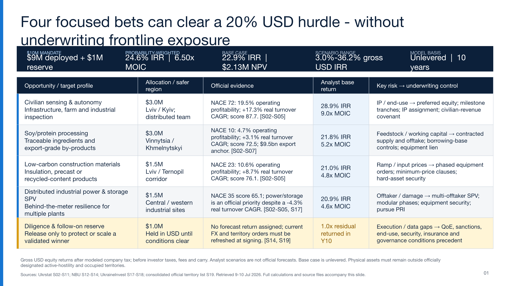

# Sol vs Fable — two AI agents, one Ukraine investment brief

**Same prompt. Same data source. Two different AI coding agents. One public head-to-head.**

I gave the *identical* task — *"act as an investment research analyst, use only official Ukrainian government statistics, and build a 10-year, $10M investment plan as one big slide plus a folder of calculations and sources"* — to **OpenAI Codex** and **Claude Code**, then published exactly what each produced, untouched.

Why Ukrainian government statistics (Ukrstat)? Tons of open data, messy datasets that need real cleaning, and an SDMX API that is a genuine data-science nightmare. A good stress test for how these agents handle real, ugly, open-government data.

## The contenders

| | 🟦 **Sol** | 🟪 **Fable** |
|---|---|---|
| Tool | OpenAI Codex | Claude Code |
| Model | `gpt-5.6-sol` | `claude-fable-5` |
| Reasoning effort | xhigh | xhigh (`/effort xhigh`) |
| Plan mode | yes | yes |
| Output | [`gpt-5.6-sol-investment-research/`](./gpt-5.6-sol-investment-research/) | [`claude-fable-5-investment-research/`](./claude-fable-5-investment-research/) |

## Headline scorecard

| | Sol (Codex) | Fable (Claude) |
|---|---|---|
| Files generated | **60** | **45** |
| Data sources actually parsed by code | ~8 | ~8 (+ heavy web search) |
| Tokens | 1.2M (1.1M input) | 0.9M **+ 4.2M via a Haiku helper** |
| Est. cost | **~$28** | **~$80** (+$7 Haiku) |
| Clarifying questions | 10+ in a ~1h session | ~3 at the start, then quiet for 2.5h |
| Standout deliverable | live formula-driven **Excel model** | 20k-path **Monte Carlo** + Kelly optimizer |
| Sources | official + secondary/press | official-only |

Full breakdown → **[COMPARISON.md](./COMPARISON.md)** · exact prompt → **[PROMPT.md](./PROMPT.md)** · data provenance → **[DATA.md](./DATA.md)** · writeup → **[POST.md](./POST.md)**

## The output slides

**Sol (Codex)** — one 16:9 investment-committee slide (also exported as `.pptx` and `.pdf`):



**Fable (Claude)** — a self-contained HTML slide:
[`claude-fable-5-investment-research/slide/slide.html`](./claude-fable-5-investment-research/slide/slide.html) · [live artifact](https://claude.ai/code/artifact/0eaa9841-ebbc-4851-b2d6-1c0a14d9bd51)

## Repo layout

```
.
├── README.md            ← you are here
├── PROMPT.md            ← the exact prompt given to both agents
├── COMPARISON.md        ← detailed comparison (headline figures + measured-from-logs appendix)
├── POST.md              ← the LinkedIn writeup
├── DATA.md              ← data sources, licensing/attribution, disclaimer
├── LICENSE
├── gpt-5.6-sol-investment-research/       ← OpenAI Codex output, copied verbatim
└── claude-fable-5-investment-research/    ← Claude Code output, copied verbatim
```

Each model folder is **published exactly as the agent produced it** (only the folder name was standardized) so you can inspect the raw output, the calculations, and the raw downloaded data yourself. Each folder has its own README with reproduction commands.

## Reproducing

Both agents were given the same prompt on **2026-07-09** and told to use only official Ukrainian government data.
- **Sol:** Node/JS pipeline (`.mjs`) + a Python PDF export; regenerate via the scripts in `.../calculations/`.
- **Fable:** four Python scripts (`uv`-managed, PEP 723 inline deps) in `calculations/`; run with `uv run`.

## Disclaimer

This repository is an **AI-tooling comparison** — a look at how two coding agents behave on the same messy real-world data task. **It is not investment advice.** Both investment "theses" were generated by AI models and, as the comparison documents in detail, the actual dollar allocations rest largely on hand-set analyst assumptions rather than on the downloaded data. Do not make investment decisions based on anything in this repo. All third-party data belongs to its original providers (see [DATA.md](./DATA.md)).
